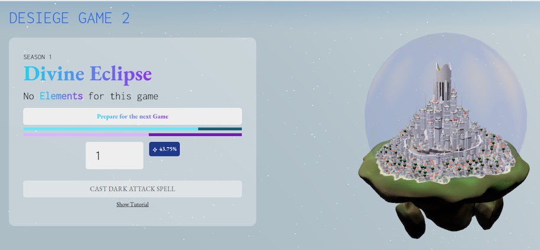

[](https://discord.gg/uQnjZhZPfu)
[](https://twitter.com/LootRealms)



# 🛡️ Desiege

### Desiege - A team-based coordination game built on Starknet.

Desiege is a Massively PvP experience built on StarkNet.

**This folder contains Desiege Game contracts. If you're looking for another contract, please see the [directory of our Realms Smart Contracts](/).**

### Game module overview

| Module          | Function                             | Current Status |
| --------------- | ------------------------------------ | -------------- |
| [TowerDefence](./01_TowerDefence.cairo)        | The core Desiege contract | In review      |
| [TowerDefenceStorage](./02_TowerDefenceStorage.cairo)       | Storage variables for Desiege                  | In review      |
| [GridMovement](./03_GridMovement.cairo)       | Checks movement logic                 | In review      |
| [Elements](./04_Elements.cairo)      | Users can mint Elements               | In review      |

<hr>

## Understanding the code
<details><summary> 🤔 What is the game?</summary>

<p>
Players select a team (Light or Dark) and need to coordinate to ensure a victory for their team.

Light players can cast a Shield spell and defend the city.

Dark players can cast an Attack spell and destroy the city.

</p>
</details>
<details><summary>🏗️ System architecture</summary>

- TODO: Add system architecture @micksabox

</details>

<details><summary>📦 Contract hierarchy</summary>
<p>

- TODO: Add contract hierarchy @micksabox

</p>
</details>
<hr>

## Getting Setup

<details><summary>Initial Setup</summary>
<p>
Clone this repo and use our docker shell to interact with starknet:

```
git clone git@github.com:BibliothecaForAdventurers/realms-contracts.git
cd realms-contracts
bin/shell starknet --version
```

The CLI allows you to deploy to StarkNet and read/write to contracts
already deployed. The CLI communicates with a server that StarkNet
runs, which bundles the requests, executes the program (contracts are
Cairo programs), creates and aggregates validity proofs, then posts them
to the Goerli Ethereum testnet. Learn more in the Cairo language and StarkNet
docs [here](https://www.cairo-lang.org/docs/), which also has instructions for manual
installation if you are not using docker.

</p>
</details>
<details><summary>Development Workflow</summary>

If you are using VSCode, we provide a development container with all required dependencies.
When opening VS Code, it should ask you to re-open the project in a container, if it finds
the .devcontainer folder. If not, you can open the Command Palette (`cmd + shift + p`),
and run “Remote-Containers: Rebuild and Reopen in Container”.

## Outline

Flow:

1. Compile the contract with the CLI
2. Test using pytest
3. Deploy with CLI
4. Interact using the CLI or the explorer

### Compile

The compiler will check the integrity of the code locally.
It will also produce an ABI, which is a mapping of the contract functions
(used to interact with the contract).

Compile all contracts:

```
nile compile
```

Compile an individual contract:

```
nile compile contracts/desiege/01A_TowerDefence.cairo
```

### Test

Run all github actions tests: `bin/test`

Run individual tests

```
bin/shell pytest -s testing/l2/desiege/01_TowerDefence_test.py
```

### Deploy

- TODO: Add deploy instructions here @micksabox

Start up a local StarkNet devnet with:

```
nile node
```

Then run the deployment of all the contracts. This uses nile
and handles passing addresses between the modules to create a
permissions system.

```
bin/deploy
```
</details>

<hr>

## Contributing

<details><summary>Modules in progress</summary>
- TODO: Add Modules in progress here @micksabox
</details>

<details><summary>How to Contribute</summary>

We encourage pull requests!

1. **Create an [issue](https://github.com/BibliothecaForAdventurers/realms-contracts/issues)** to describe the improvement you're making. Provide as much detail as possible in the beginning so the team understands your improvement.
2. **Fork the repo** so you can make and test changes in your local repository.
3. **Test your changes** Follow the procedures for testing in each contract sub-directory (e.g. [/contracts/settling_game](./contracts/settling_game/) and make sure your tests (manual and/or automated) pass.
4. **Create a pull request** and describe the changes you made. Include a reference to the Issue you created.
5. **Monitor and respond to comments** made by the team around code standards and suggestions. Most pull requests will have some back and forth.

If you have further questions, visit [#builders-chat in our discord](https://discord.gg/yP4BCbRjUs) and make sure to reference your issue number.

Thank you for taking the time to make our project better!

</details>
<hr>

## External Reading Sources

StarkNet is very new. Best practices are being discovered. We have amalgamated the best resources we think to guide you on your journey.

<details><summary>Guides & Docs</summary>

- https://perama-v.github.io/cairo/intro/
- https://hackmd.io/@RoboTeddy/BJZFu56wF
- https://starknet.io/docs/
</details>
<details><summary>Discords to Join</summary>

- [StarkNet](https://discord.gg/XzvgKTTptb)
- [MatchBox DAO](https://discord.gg/uj7wMxsmYw)
</details>

## Realms Repositories

The Realms Settling Game spans a number of repositories:

| Content         | Repository       | Description                                              |
| --------------- | ---------------- | -------------------------------------------------------- |
| **contracts**       | [realms-contracts](https://github.com/BibliothecaForAdventurers/realms-contracts) | Starknet/Cairo and Ethereum/solidity contracts.          |
| **ui, atlas**       | [realms-react](https://github.com/BibliothecaForAdventurers/realms-react)     | All user-facing react code (website, Atlas, ui library). |
| **indexer**         | [starknet-indexer](https://github.com/BibliothecaForAdventurers/starknet-indexer) | A graphql endpoint for the Lootverse on Starknet.        |
| **bot**             | [squire](https://github.com/BibliothecaForAdventurers/squire)           | A Twitter/Discord bot for the Lootverse.                 |
| **subgraph**        | [loot-subgraph](https://github.com/BibliothecaForAdventurers/loot-subgraph)    | A subgraph (TheGraph) for the Lootverse on Eth Mainnet.  |
